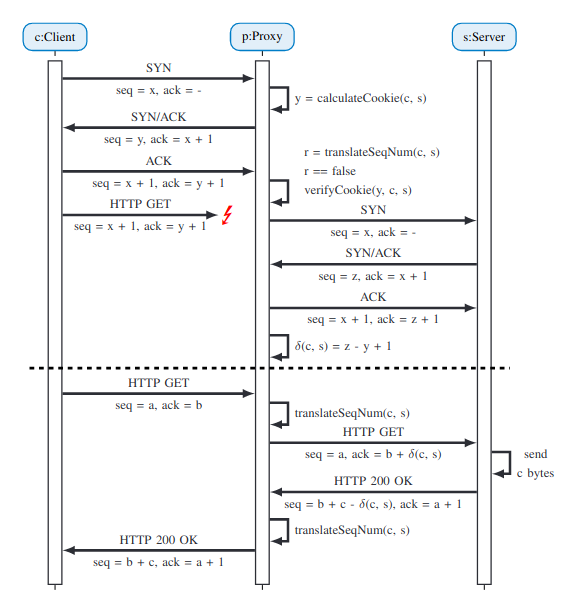
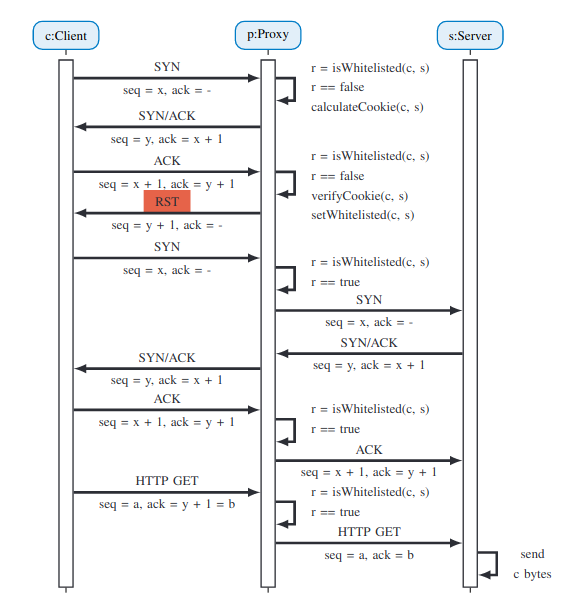
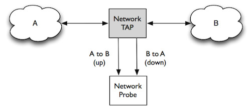
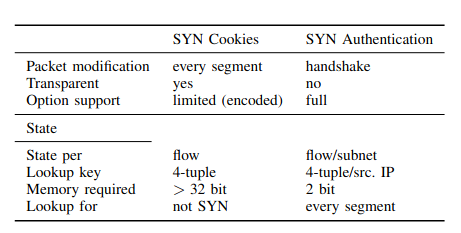

## TCP packet construction
Header contains 
* Source and destination addresses.
* SYN (synchronize) and ACK (acknowledge) flags.
* Other valuable information (see figure below).

## TCP establish connection
* Client sends SYN.
* Server receives and responds with SYN ACK.
* Client receives and responds with ACK. 

This process is the 3-way handshake to establish a Client-Server connection [Fox, 2019].

## TCP SYN-Attack
* Malicious client sends 1 part of 3-way handshake, SYN segment.
* The server notices this flow, allocates resources for the connection
* The server acknowledges by sending a TCP SYN ACK segment and continues waiting for the client's response.
* The client continues sending these TCP/IP segments to establish various TCP connections.
* Indefinitely, the server can run out of resources allocated to these connections - resulting in deadlock, and possible valid TCP connections being dropped.
  [Scholz, 2020]

## Traditional SYN-Attack Mitigation Strategies
### Naive Strategies
* Increased Server backlog
  * Scaling the capacity of TCP stack storage.
* Reduced SYN timer
  * Decrease the time allowed between sending SYN-ACK and waiting to receive ACK.
* Overwriting half-opened TCP Stack entries
  * Replace oldest half-opened connection with incoming SYN segment. 

These methods are proven to be ineffective [rfc4987, 2007] since the attacker could easily linearly scale the frequency of SYN-segments sent.

### More Reliable Strategies
* SYN-cookies
  * Uses a hidden cryptographic hash function to compete and store a secrete key. 
  * Function of the timestamp and source- and destination address of the received SYN-segment.
  * Only adds an entry to the TCP stack once the final ACK is received and corresponds with the hash value stored.
  * Finally opens connection between client and server.
  [A10 Networks, 2019]
* Firewall & Proxy Filtering
  * Ensures that only legitimate connections are established with the end user/server.
  *  By handling the 3-way handshake on the firewall side and passing the connection via proxy to server [rfc4987, 2007].
  

## P4 programmable data plane
Programmable data planes (PDP) enables network operators with a tool to change/modify the purpose of a network switch. 

### PPPP - Alien communication or new data plane tool?
The acronym PPPP stands for Programming Protocol-Independent Packet Processors. P4 is a programming language for controlling packet forwarding planes in network devices. It is open source and maintained by the P4 Language Consortium (https://p4.org/).

### Putting the pro in programmable - advantages of PDP
* Check and modify packet headers s.t custom requirements [Gao, 2021].
* Encapsulate and forward packets with a non-IP protocol defined via an IP network [Jacobs, 2019].
* Utilize hardware speeds (100 Gb/s) to perform tasks.
* Load balancing, comms with other devices via controller [Geo, 2021].
* More Cost-effective (time and monetary) than purpose specific chips.
* Adaptable for new application scenarios.
* Apply resources according to case requirements.

### Limitations of PDP's
  * Although PDP is capable of doing competitions it's at the expense of throughput.
  * PDP's only supports simple arithmetic operations thus precalculations and/or approximations need to be loaded in a match-table or registers.
  * Lacks correctness verification - developers writing code for forwarding behavior on the data plane of a pdp is not as knowledgeable as the equipment manufacturer.

### Noteworthy mentions - Use cases for PDP's
* Traffic Measurement and -Engineering
  * Congestion detection
  * Active queue management
  * Load balancing
* Routing and Forwarding
  * L4 load balancing
  * Source routing
  * Named data networking
* Advanced Network Support
  * 5G networks
  * IoT
  * Time-sensitive networks  
* Network Security
  * Intrusion detection
  * Encryption
  * DDos attack mitigation [project focus]
  * Topology scrammingling
* Network Accelerated Computing
  * Machine learning
  * Assist Deep packet inspection

[Geo, 2021]

## P4 SYN-Flood attack Mitigation Strategies
The concept of a SYN-Proxy is based on the idea of intercepting potentially harmful traffic before it reaches the server. 
In addition, installing a dedicated SYN-Proxy allows the server to save resources by not handling attack mitigations itself.

According to [Scholz, 2020] only the following strategies provide adequate protection and high service quality: 
* SYN-Cookie.
* SYN-Auth with cryptographic hash.
* SYN-Auth without cryptographic hash.

### SYN-Cookie 
* Secured with a cryptographic hash bound to the flow.
* expects an appropriate final segment of TCP handshake.
* On Completion connection is forwarded to the application.

Fig. above shows SYN-Cookie message exchange strategy.
  
### SYN-Authentication
* Whitelists the client or client's subnet on completion.
* Accepts future connections from source or subnet.
* Can be combined with a cryptographic hash.
  

Fig. above shows the simplicity of SYN-Authentication message exchange strategy.

## The Setup
In the study [Scholz, 2020], the stack used to find if it is possible to mitigate SYN-attacks with a programmable data plane is described below.

### Software Packet Processing Prototype
* `Libmoon` for SYN proxy prototype in software targeting Commercial Off The Shelf hardware.
  * Powerful and easy-to-use scripting on top of DPDK's packet handling.
  * Proxy runs as userspace program.
  * TCP handshake done by proxy application.
  * Libmoon receives and processes packets in batches.
* Hash function
  * Peudo-cryptographic `SipHash` function for cookies and hashmap
  * `SipHash` can be integrated with programmable software and hardware dataplanes. [Found here](https://www.net.in.tum.de/fileadmin/bibtex/publications/papers/2019-P4-workshop-hashing.pdf).
* Connection State Tracking
  * Garbage collection with __second chance page replacement__ algorithm.
  * Each state extends two bits. If neither are in a set state, entry is inactive and removed.
* SYN-Authentication
  * Fixed size `bitmap` as Data Structure (DS) for whitelist.
  * ForEach, two bits used for second-chance page replacement algorithm for __total of 1GB for entire IPv4 address space__.
  * IPv6 whitelisting based on subnet or hash-based DS.
* SYN-Cookies
  * Two hash maps (`active` and `history`) in conjunction
  * `history` replace is periodically deleted and replace by an `active` map, and new empty active hash map is initialized.
  * 2-phase lookup - First `active` map is checked. 
  * If entry exists it is returned. 
  * Else same lookup is done in `history` map and entry is copied to `active` and employs the second chance mechanism. 
  * Else if no entry is found the connection is assumed to not exist. 
  * Inserts are exclusive to `active` map. 
* Optimizations
  * Offloading feature of NIC used for checksum calculation.
  * ForEach TCP packet received only one action is performed resulting in one outgoing packet.
  
### Programmable Data Plane Prototype
P4 enables rapid development cycles and creates portable implementations of network applications for ASIC, FPGA and SmartNIC data planes.
* Realized Programs and Targets
  * SYN cookie and SYN authentication strategies implemented with P4 program
  * Test functionality using Mininet-based bmv2 P4 target switch.
  * Small modifications to P4 programs due to using different P4 architecture models.
  * Used Targets t4p4s since it uses the same underlying framework as libmoon implementation.
  * Ported implementation to FPGA based data plane - Agilio Network Flow Processor (NFP)-4000 SmartNIC and NetFPGA SUME
* Program Core
  * Packets are parsed up to and incl. TCP header.
  * MAC addresses are updated using a lookup table.
  * Packets are modified to strategy used, TCP flags set and state stored by proxy.
  * State is maintained as a match-action table, requiring one lookup for each segment.
  * IP addresses are swapped.
  * TCP checksum is updated.
  * Packet is transmitted (egress).
* Cookie Calculation
  * Integration of cryptographic hash functions in P4 data planes is possible for software, NFP and FPGA targets.
  * Integration of SipHash as an extern on the software target is possible as it can be added as a library to the hardware dependent t4p4s code.
  * Alternatively, to a raw time-stamp access is by using a table containing a counter to represent a timestamp value which the control plane updates.
* Whitelisting
  * Match-action Table is used for whitelisting
  * Data plane informs control plane via digest message when a flow or IP address should be whitelisted
  * Control plane adds entry to whitelist table
  * Alternatively, a bloom-filter DS built in registers can be used. Complexity of implementing this approach makes it less appealing (evicting outdated entries, increased resource consumption of P4 program).

## VT role in flow monitoring application

On a probe flow records are created for every SYN-packet received, If A wants to flood B's server and VT is in the middle. Without protection VT's monitoring system/probe will also be flooded. To prevent this from happening VT can:

- Deploy a PDP between the network tap and -Probe
- Program PDP s.t only ACK-packets and all packets from whitelisted source are allowed to reach Network Probe
- Add the source address of the ACK packet (on the Probe) to a whitelist if the list does not contain the current packet-source.
- Add a counter on PDP keeps track of amount of SYN-packets received.
- Add a counter on Probe keeps track of amount of ACK-packets received
- If # SYN != # Ack, then VT knows that a Server is under-attack and inform target server operators (dalk nie moontlik nie, since flood could happen in < 13 min [Sandre](https://www.researchgate.net/publication/241631418_The_effects_of_DDoS_attacks_on_flow_monitoring_applications) )
- Goal-specific NIC on Probe might be needed s.t only ACK-packets are expected. 

### Results
Summary of the results obtained by [Scholz, 2020].

Table shows how SYN-Cookie and SYN-Auth compares in a proxy setup. 
* Both strategies have differences w.r.t packet modifications, transparency and Option support.
* More memory required for SYN-cookie than SYN-auth, 32 bits to 2 bits.
* Due to the 3-way handshake design, ACK segment cannot be differentiated from third segment of handshake, proxy has to check every segment against whitelist. 

## Conclusion 
The client puzzle (including a cryptographic hash value to packet) is the best defense strategy. This guarantees no malicious connections to be established with server.
A more scalable solution is a stand alone SYN-proxy running on a dedicated node. This would allow protection for entire networks without decreased server performance. The study finds a scaled version of their prototype implementation to mitigate SYN-Flood attacks at 10 GbE line-rate.

The P4 solution is easier to implement and can be ported to different target platforms, particularly hardware devices which achieve lower latency with less or no outliers.

From [Scholz, 2020](https://arxiv.org/pdf/2003.03221.pdf), We conclude that effective and efficient SYN flood mitigation on modern data planes is possible. 
SYN-cookies and SYN-auth perform equally well, moreover the simplicity of the SYN-auth implementation makes it a more attractive solution. However, a limiting factor for this solution is finding a suitable cryptographic hash function, but could be solved thanks to recent developments in hash operations being implemented in hardware. This would allow for powerful data plane centric SYN-Flood mitigation. 

## Sources 
[A Review of P4 Programmable Data Planes for Network Security, Ya Geo, Zhenling Wang](https://downloads.hindawi.com/journals/misy/2021/1257046.pdf)

[Me Love (SYN-)Cookies: SYN Flood Mitigation in Programmable Data Planes, Scholz Et Al.](https://arxiv.org/pdf/2003.03221.pdf)

[TCP SYN Flooding Attacks and Common Mitigations, RFC4987](https://datatracker.ietf.org/doc/html/rfc4987)

[The effects of DDoS attacks on flow monitoring applications, Sandre, et al.](https://www.researchgate.net/publication/241631418_The_effects_of_DDoS_attacks_on_flow_monitoring_applications)

[Transmission Control Protocol (TCP), Pamela Fox](https://www.khanacademy.org/computing/computers-and-internet/xcae6f4a7ff015e7d:the-internet/xcae6f4a7ff015e7d:transporting-packets/a/transmission-control-protocol--tcp)

[What are Syn Cookies and how are they used?, A10 Networks](https://youtu.be/ymttSrEo0R0)

[What is a programmable data plane and where does P4 fit in?, David Jacobs](https://www.techtarget.com/searchnetworking/answer/What-is-a-programmable-data-plane-and-where-does-P4-fit-in)

## Helpful links
[p4lang github](https://github.com/p4lang)

[p4 discussion forum](https://forum.p4.org/)

[P4_16 Language Specification](https://p4.org/p4-spec/docs/P4-16-v1.0.0-spec.html#sec-p4-type)

[Scapy Docs](https://buildmedia.readthedocs.org/media/pdf/scapy/latest/scapy.pdf)